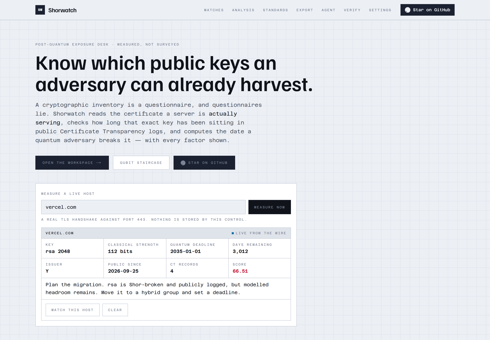
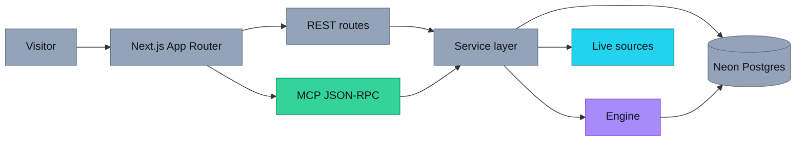
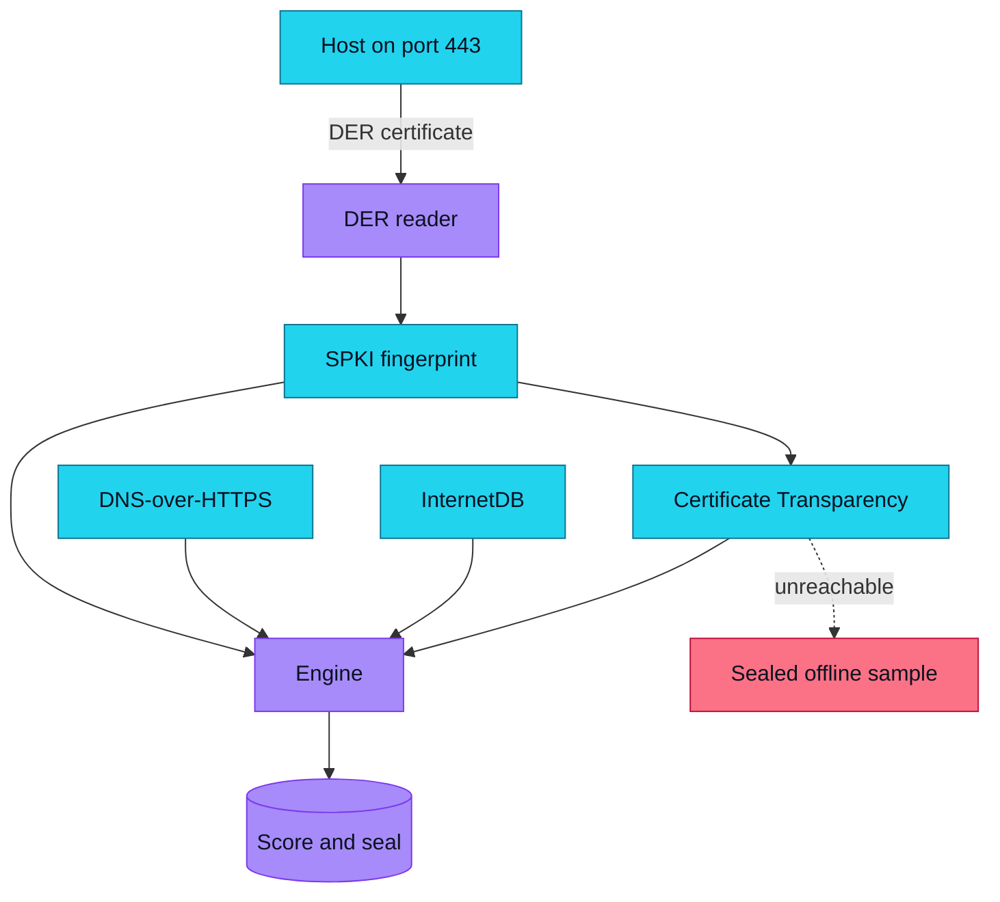
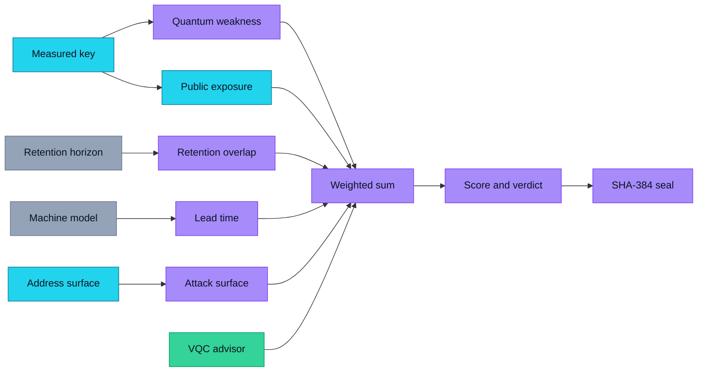
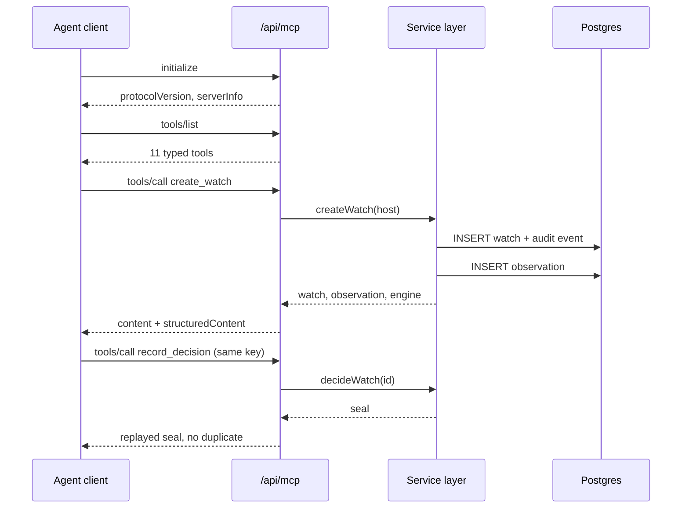
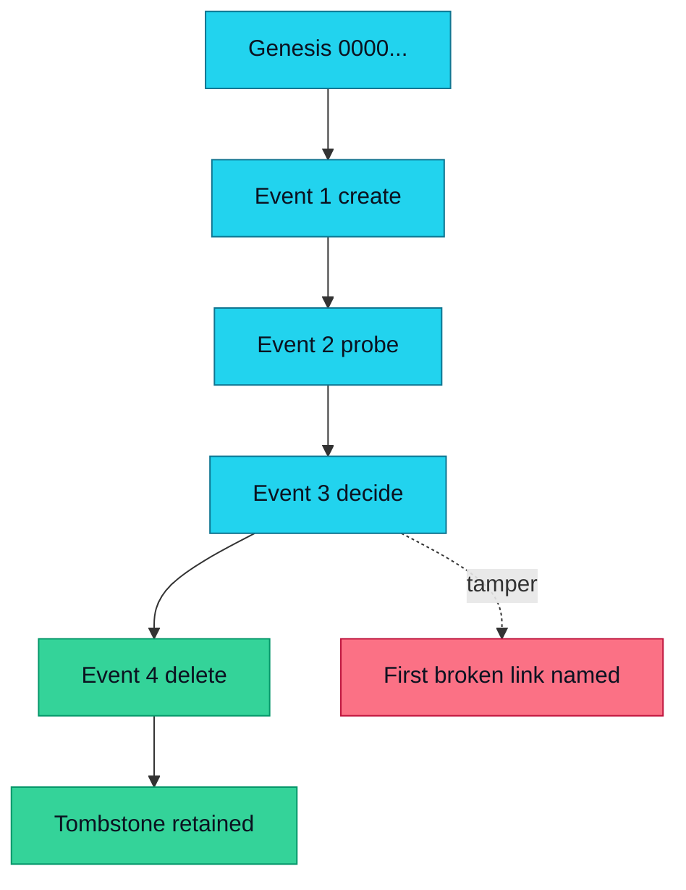
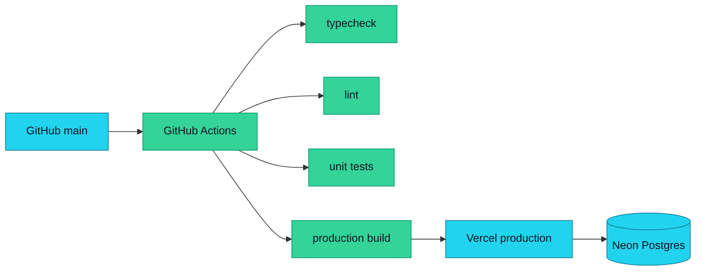
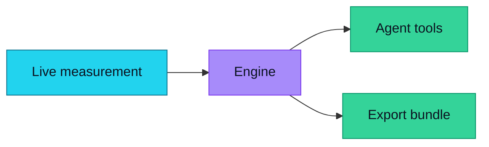
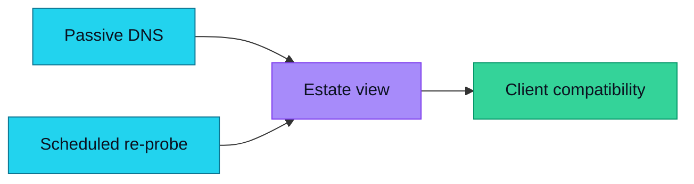
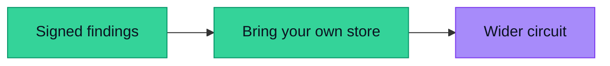

<div align="center">

# Shorwatch

### Know which public keys an adversary can already harvest.

[](https://shorwatch-aniruddha-adaks-projects.vercel.app)
[](LICENSE)
[](https://www.typescriptlang.org)
[](https://nextjs.org)
[](https://nodejs.org)
[](https://crt.sh)
[](https://shorwatch-aniruddha-adaks-projects.vercel.app/agent)
[](https://vitest.dev)
[](.github/workflows/ci.yml)

**[Live App](https://shorwatch-aniruddha-adaks-projects.vercel.app)** ·
**[Source](https://github.com/aniruddhaadak80/shorwatch)** ·
**[Agent](https://shorwatch-aniruddha-adaks-projects.vercel.app/agent)** ·
**[API](https://shorwatch-aniruddha-adaks-projects.vercel.app/api/health)** ·
**[Issues](https://github.com/aniruddhaadak80/shorwatch/issues)**

</div>

---

A cryptographic inventory is a questionnaire, and questionnaires lie.

Shorwatch reads the certificate a server is **actually serving**, parses the
SubjectPublicKeyInfo out of the DER, checks how long that exact public key has
been sitting in public Certificate Transparency logs, and computes the date a
quantum adversary breaks it — showing every factor that produced the number.

It takes about ten seconds to get your first finding, needs no account and no
API key, and every constant it uses is printed on `/standards`.



## ✨ Features

- **Measures the key, not a claim about it.** A real TLS handshake on port 443;
  the RSA modulus size, named curve and algorithm OID are read from the DER
  bytes that came off the socket.
- **Answers the question a handshake cannot.** The exact SPKI fingerprint is
  matched against Certificate Transparency logs, so you learn *since when* the
  key has been harvestable rather than only what it is today.
- **Explains every score.** Five weighted factors produce an exposure score and a
  projected quantum deadline. Each factor shows the measurement behind it, and
  the result is sealed with SHA-384 so a doctored score is detectable.
- **Genuinely post-quantum-aware.** Recognises ML-DSA, ML-KEM and OpenSSL hybrid
  key-agreement OIDs, so a key that is already quantum-safe is reported as
  quantum viable instead of being falsely flagged.
- **Re-ranks your queue from a real model.** The qubit staircase on `/analysis`
  recomputes every deadline as you change the assumed machine, so the first
  rotation you do is the first one that matters.
- **Leaves with an artefact.** An OpenSSL 3.5 hybrid configuration generated from
  the key you measured, a runbook printing the deadline arithmetic, and a sealed
  JSON dossier.
- **Scriptable.** Eleven typed tools over JSON-RPC 2.0, with idempotent
  mutations that travel the same service layer the buttons do.

## 🚀 Quickstart

```bash
git clone https://github.com/aniruddhaadak80/shorwatch.git
cd shorwatch
npm ci
npm run dev
```

Open <http://localhost:3000>, type a host, and press **Measure now**.

**No environment variables are required.** Development runs against an embedded
PGlite database created on first use, and every live source is keyless.

### Production variables

| Variable | Required | Purpose |
| --- | --- | --- |
| `DATABASE_URL` | **Yes in production** | Neon Postgres (or any Postgres) connection string. Without it a production build refuses to start rather than silently using the embedded store. |
| `NEXT_PUBLIC_SITE_URL` | No | Public base URL used for metadata, sitemap and OpenGraph. Defaults to the verified production alias. |
| `SHORWATCH_PGLITE_DIR` | No | Embedded database directory for local development. Defaults to `./.pglite`. |
| `SHORWATCH_ALLOW_EMBEDDED_STORE` | Local only | Set to `1` to let `next start` run without `DATABASE_URL`. Never set this on a deployment. |

### Quality gates

```bash
npm run typecheck   # tsc --noEmit, strict
npm run lint        # eslint, zero warnings tolerated
npm run test        # 93 unit tests
npm run build       # production build
npm run check       # all four in sequence
npm run test:e2e    # browser journey (starts its own server)
npm run verify      # live verification against BASE_URL
npm run screenshots  # regenerate docs/ from a deployment
```

## 🔌 API

Every response uses one envelope: `{ "data": … }` on success, and
`{ "error": { "code", "message", "field?" } }` on failure. List endpoints are
paginated and every read is scoped to the calling session.

```bash
BASE=https://shorwatch-aniruddha-adaks-projects.vercel.app

# Health, including the real production store check
curl -s $BASE/api/health

# Measure a host and persist the finding
curl -s -X POST $BASE/api/watches \
  -H 'content-type: application/json' \
  -d '{"host":"vercel.com","label":"main site"}'

# Read it back
curl -s $BASE/api/watches/<id>

# Change the confidentiality horizon, then re-measure
curl -s -X PATCH $BASE/api/watches/<id> \
  -H 'content-type: application/json' \
  -d '{"retentionYears":25}'

curl -s -X POST $BASE/api/watches/<id>/probe

# Replay the audit chain
curl -s $BASE/api/watches/<id>/decide

# Export the migration bundle
curl -s "$BASE/api/export?id=<id>&format=openssl" -o openssl.cnf

# Delete, which requires the record's current engine seal
curl -s -X DELETE $BASE/api/watches/<id> \
  -H 'content-type: application/json' \
  -d '{"seal":"<engine.seal from the read-back>"}'
```

### Agent interface

The endpoint is a live MCP-style JSON-RPC 2.0 server supporting `initialize`,
`tools/list` and `tools/call`.

```bash
curl -s -X POST https://shorwatch-aniruddha-adaks-projects.vercel.app/api/mcp \
  -H 'content-type: application/json' \
  -d '{"jsonrpc":"2.0","id":1,"method":"tools/call",
       "params":{"name":"probe_host","arguments":{"host":"arxiv.org"}}}'
```

| Tool | Kind | Purpose |
| --- | --- | --- |
| `probe_host` | analysis | Live handshake, CT corroboration and a full engine result. Stores nothing. |
| `list_watches` | read | The caller's watches with their latest summary. |
| `get_watch` | read | One watch with every stored key observation. |
| `rank_watches` | read | Every watch ordered by deadline urgency. |
| `verify_integrity` | read | Replays chains and names the first broken link. |
| `export_migration_bundle` | read | OpenSSL config, runbook and JSON dossier. |
| `create_watch` | **write** | Creates a watch, measures it live, persists the observation. |
| `update_watch` | **write** | Changes label, retention or the machine model. |
| `record_decision` | **write** | Records the triage decision, same endpoint as the buttons. |
| `delete_watch` | **write** | Soft-deletes behind a seal check, leaving a tombstone. |
| `set_machine_model` | **write** | Stores the assumed adversary machine. |

Mutations accept `idempotencyKey`, so retrying never duplicates. The live
configuration is served at
[`/mcp.json`](https://shorwatch-aniruddha-adaks-projects.vercel.app/mcp.json).

## 📁 Project map

### User routes

| Route | Purpose |
| --- | --- |
| `/` | Product entry with a live measurement that stores nothing |
| `/watches` | Workspace: create, filter, sort and paginate watches |
| `/watches/[id]` | Dynamic detail: the measured certificate, factor ledger, resource estimate, decision, edit and delete |
| `/analysis` | The qubit staircase and the ranked queue |
| `/standards` | Every constant the engine uses, with its source |
| `/agent` | Live JSON-RPC console with preloaded one-click calls |
| `/export` | Migration runbook, OpenSSL configuration and JSON dossier |
| `/verify` | Audit chain replay for every record |
| `/settings` | Confidentiality horizon and assumed machine |

### API routes

| Route | Methods | Purpose |
| --- | --- | --- |
| `/api/health` | GET | Real store round-trip and adapter identity |
| `/api/watches` | GET, POST | List with filters, create and measure |
| `/api/watches/[id]` | GET, PATCH, DELETE | Read with observations, update, guarded delete |
| `/api/watches/[id]/probe` | POST | Re-measure the host from the wire |
| `/api/watches/[id]/decide` | GET, POST | Record a decision, or replay this chain |
| `/api/analysis` | GET | The ranked queue plus the session's settings |
| `/api/integrity` | GET | Replay every visible chain |
| `/api/export` | GET | Download the bundle as text, OpenSSL config or JSON |
| `/api/settings` | GET, PATCH | Read and write the stored assumptions |
| `/api/mcp` | GET, POST | JSON-RPC 2.0 endpoint |

### Library

| Path | Responsibility |
| --- | --- |
| `src/lib/der.ts` | DER reader that extracts and fingerprints the SPKI |
| `src/lib/engine/` | Scoring engine, resource model and the quantum advisor |
| `src/lib/integrity/seal.ts` | Canonical JSON and the SHA-384 chain |
| `src/lib/sources/` | Live adapters and the sealed offline fallback |
| `src/lib/db/` | Schema, Neon adapter, PGlite adapter |
| `src/lib/service.ts` | The single service layer every write path uses |
| `src/lib/mcp/tools.ts` | Tool definitions and handlers |
| `src/proxy.ts` | Anonymous session ownership |

## 🧭 How it works

### System architecture



### Data pipeline and the sealed fallback



Fallback data is always labelled `status: "fallback"` and is never merged into a
user record. A user-created finding is never replaced by fallback data.

### The deterministic engine



Weights: quantum weakness `0.30`, public exposure `0.22`, retention overlap
`0.20`, lead time `0.16`, attack surface `0.12`. Sum to exactly `1.00`.

### Agent sequence



### Integrity and seal replay



`seal_n = SHA-384( UTF-8(seal_{n-1}) || canonicalJson(event_n) )`, where
canonical JSON sorts object keys recursively and preserves array order. Delete is
a soft delete so the chain stays replayable.

### Deployment



## 🔐 The engine

`shorwatch-quantum` 1.0.0 returns a score, itemised factors with their weights
and contributions, a verdict, an actionable recommendation, a projected CRQ date
and a SHA-384 seal. The UI, the REST endpoint and the MCP tool all call the same
function.

Anchored on **Gidney & Eakerå (2019)**: 4,098 logical qubits and ~20,000,000
physical qubits at `p = 1e-3` factor RSA-2048 in 8 hours.

```
L(n)   = 4098 · (n / 2048) · (log₂n / 11)
d(p)   = round(13 · log₂(1/p) / log₂(1000)), minimum 3
P(n,p) = L(n) · (d / 13)² · (20000000 / 4098)
crq(n) = 2035 + 7.7 · log₂(n / 2048), clamped to 2028–2060
```

The **quantum advisor** is a two-qubit variational circuit evaluated by exact
statevector arithmetic — no sampling, so the engine stays deterministic and the
REST and agent paths return byte-identical results. Its bounded ±3.5 point
adjustment is derived from ⟨Z₀⟩ and ⟨Z₀Z₁⟩ with frozen, published weights.

## 🗺️ Roadmap

### Now

- [x] Measure the live key from a real TLS handshake and parse its SPKI
- [x] Corroborate the key against Certificate Transparency by fingerprint
- [x] Publish a versioned, explainable engine with unit-tested vectors
- [x] Ship eleven typed MCP tools over JSON-RPC 2.0
- [x] Export an OpenSSL 3.5 hybrid configuration and a runbook



### Next

- [ ] **Passive DNS and SAN enumeration**, so a watch covers an estate rather
  than one hostname
- [ ] **A scheduled re-probe**, so a key rotation is detected and the chain
  records the change automatically
- [ ] **Client-side compatibility matrix**, answering "can my oldest client still
  negotiate a hybrid group?"



### Later

- [ ] **Signed findings**, so an exported dossier can be attested to a key
- [ ] **Bring-your-own-store**, so a team can keep findings in their own database
- [ ] **A wider circuit**, replacing the two-qubit advisor once a labelled
  corpus exists to train against



## 🔒 Security model

- **No accounts.** An HTTP-only cookie holds a 128-bit random owner id, set in
  `src/proxy.ts` before any render.
- **No cross-session access.** Every query is scoped by `owner_id`; another
  session's record returns 404 rather than 403, so it does not confirm existence.
- **Guarded deletion.** `DELETE` requires the record's current engine seal, which
  only something that could already read the record knows.
- **Auditable history.** Every write appends to a SHA-384 chain, and `/verify`
  names the first broken link.
- **Input validation.** Hosts, labels, notes, retention and machine models are
  bounded and enum-checked; SQL is always parameterised.
- **Abuse control.** Per-session write limits. On serverless these are best-effort
  and per instance; the durable limits are the unique constraints, the bounded
  list endpoints and owner scoping. See [SECURITY.md](SECURITY.md).

## 📡 Data provenance

| Source | What it provides | Attribution |
| --- | --- | --- |
| TLS handshake | The certificate and key actually served | [node:tls](https://nodejs.org/api/tls.html) |
| Cert Spotter | Certificate Transparency issuances | [sslmate.com](https://sslmate.com/certspotter/api/) |
| Google DNS-over-HTTPS | CAA and address records | [developers.google.com](https://developers.google.com/speed/public-dns/docs/doh/json) |
| Shodan InternetDB | Address-level exposure | [internetdb.shodan.io](https://internetdb.shodan.io/) |

Every response carries its source label, upstream URL, fetch time and an explicit
`live` or `fallback` status.

## ⚠️ Safety disclaimer

Shorwatch reports measured facts and an explicitly published model. The
cryptographically relevant quantum date is an order-of-magnitude educational
projection, **not a forecast**, and nothing here is security advice. Validate
every migration decision with your own cryptographic review and current standards
guidance. The exported OpenSSL configuration is a starting point for review,
never a drop-in deployment. Only point Shorwatch at hosts you are authorised to
scan.

## 🤝 Contributing

Contributions are welcome, especially for Hacktoberfest. Good first tasks:
adding an algorithm OID with a test fixture, adding a post-quantum parameter set,
or improving an accessible state. Read [CONTRIBUTING.md](CONTRIBUTING.md) for
the quality gates and the ground rules — notably that a change to a score bumps
`ENGINE_VERSION`, and that tests must fail before the fix.


## 📄 License

[MIT](LICENSE) © Aniruddha Adak