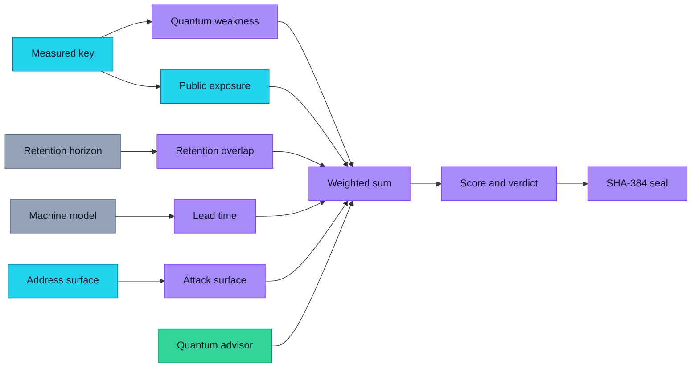
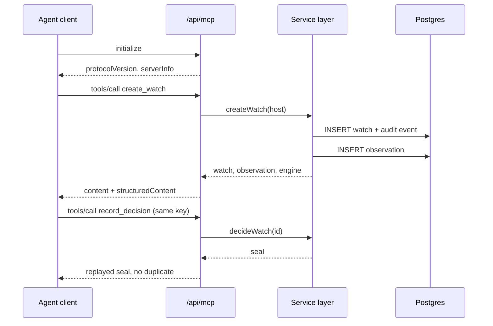
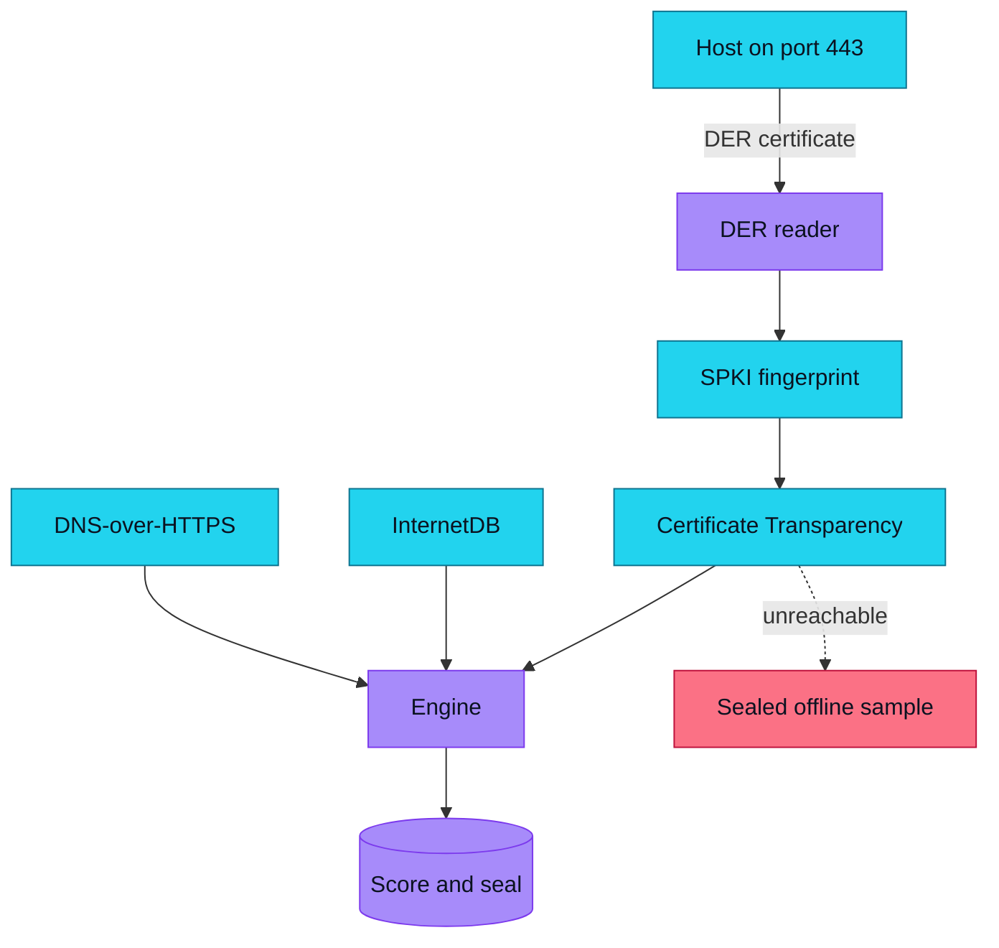

# I built a tool that reads the public key a server is actually serving — and dates when a quantum computer breaks it

Most "post-quantum readiness" tooling asks you to fill in a questionnaire about your own cryptography. That is the weakest possible input: it is self-reported, it is stale, and it is wrong most often exactly where it matters.

So I built the opposite. **[Shorwatch](https://github.com/aniruddhaadak80/shorwatch)** opens a real TLS connection to a host, parses the `SubjectPublicKeyInfo` out of the DER that comes off the socket, matches that exact fingerprint against public Certificate Transparency logs, and projects the date a cryptographically relevant quantum computer breaks it.

**Live app:** https://shorwatch-aniruddha-adaks-projects.vercel.app
**Source, MIT licensed:** https://github.com/aniruddhaadak80/shorwatch

No account. No API key. First finding in about ten seconds.


That screenshot is not a mockup. It is a real handshake with `vercel.com`: **RSA-2048, 112 bits of classical strength, quantum deadline 2035-01-01, 3,012 days remaining, publicly logged since 2026-09-25, exposure score 66.51.**

## The part that surprised me

The single most valuable line in that output is not the algorithm. It is `public since 2026-09-25`.

A TLS probe tells you what a host serves *today*. It cannot tell you *since when* anyone has been able to harvest that key — which is the entire question behind "harvest now, decrypt later". Any traffic encrypted to that key since that date is, in principle, already collected and waiting for a machine that can factor it.

Cert Spotter's issuance API returns the SHA-256 of each issuance's `SubjectPublicKeyInfo`. So I compute the fingerprint of the key being served right now and look it up. That single join turns "this host uses RSA" into "this exact key has been publicly harvestable since a date I can name".

## Measuring the key instead of trusting it

I hand-rolled the DER reader rather than pulling in a dependency, and then proved it two independent ways:

1. **Against OpenSSL.** `crypto.createPublicKey()` on the same certificate must produce a byte-identical SPKI fingerprint.
2. **Against an outside authority.** Cert Spotter publishes `pubkey_sha256` for real issuances. When my reader's fingerprint matches theirs, the parser is confirmed by a party with no stake in my code.

Two bugs surfaced during that work and are worth calling out, because both produce plausible-looking nonsense rather than an error:

- Slicing the SPKI from its *contents* instead of from its own tag byte omits the 2–4 byte TLV header. You get a valid-looking hash that matches nothing anywhere.
- An RSA public key is `SEQUENCE { INTEGER modulus, INTEGER exponent }` nested **inside** a `BIT STRING`. Read the BIT STRING once and you get the outer SEQUENCE, not the modulus — which reported RSA-2048 as 2064 bits.

Neither throws. Both quietly poison every downstream number. The tests now pin all of it, and four real certificates are checked in as fixtures.

## The engine shows its working

`shorwatch-quantum` 1.0.0 returns a score, five itemised factors, a verdict, an actionable recommendation and a SHA-384 seal. Click any factor to see the measurement that produced it.



Weights: quantum weakness `0.30`, public exposure `0.22`, retention overlap `0.20`, lead time `0.16`, attack surface `0.12` — summing to exactly `1.00`.

The deadline comes from one two-parameter model anchored on **Gidney & Eakerå (2019)**, who factored RSA-2048 in 8 hours with ~20 million noisy qubits and 4,098 logical qubits:

```
L(n)   = 4098 · (n / 2048) · (log₂n / 11)
d(p)   = round(13 · log₂(1/p) / log₂(1000)), minimum 3
P(n,p) = L(n) · (d / 13)² · (20000000 / 4098)
crq(n) = 2035 + 7.7 · log₂(n / 2048), clamped to 2028–2060
```

Every constant lives in one published file and is rendered on `/standards` with its source. Nothing is tuned to make a demo look good.

## The signature interaction

The chart on `/analysis` is a control, not an illustration. Drag the assumed machine and the whole queue re-orders, because the ordering is a consequence of the model rather than a stored opinion.


In the capture above the dashed capacity line at 20M qubits sits exactly on the RSA-2048 point. That is the Gidney–Eakerå anchor appearing in the product, and it is why RSA-2048 reads as "exposed before CRQ" rather than "safe for now" — the model you assumed has already arrived for that key size.

Building this also caught a charting bug worth naming: I normalised the log axis as `log10(v) / log10(max)`. Every plotted value shares a decade, so all four points collapsed into the top 15% of the plot box. The fix is to normalise against the log *range*, and to label the decade rules so the axis can be read rather than trusted.

## A quantum circuit that is actually deterministic

Hacktoberfest 2026 is about open tools and open models, so I wanted a genuine quantum component — not a decorative one. The engine runs a two-qubit variational circuit, `RY, RY, CNOT, RZ, CNOT`, and reads out ⟨Z₀⟩ and ⟨Z₀Z₁⟩.

The important decision: it is evaluated by **exact statevector arithmetic, not sampling**. A shot-based circuit is non-deterministic, and the engine, the REST endpoint and the MCP tool must return byte-identical results for identical input. Removing the sampling noise makes it a deterministic function of its features while remaining a real circuit. Its bounded ±3.5-point adjustment is derived from frozen, published weights.



Eleven typed tools ship over JSON-RPC 2.0 — five reads, five mutations, plus integrity replay. The mutating tools go through the *same* service functions the buttons call, so an agent and a human cannot drift apart, and `idempotencyKey` makes a retry safe. Live config is at [`/mcp.json`](https://shorwatch-aniruddha-adaks-projects.vercel.app/mcp.json).

## Nothing can be quietly rewritten

Every create, probe, update, decision and delete appends to a per-record chain:

```
seal_n = SHA-384( UTF-8(seal_{n-1}) || canonicalJson(event_n) )
```

Canonical JSON sorts object keys recursively and preserves array order, so two runs over the same logical record produce byte-identical output. Delete is a soft delete that retains a tombstone, so the chain stays replayable after you remove a record. `/verify` recomputes every link and names the first event that fails.


Deleting requires the record's current engine seal. That is a capability check, not ceremony: only something that could already read the record knows the seal, so a third party cannot destroy it.

## Leave with something you can act on

The export is not a screenshot. You get an OpenSSL 3.5 configuration generated from the key you actually measured, a runbook that prints the deadline arithmetic so it can be audited, and a JSON dossier carrying every seal and its provenance.



All four sources are keyless and time-bounded. When one is unreachable the response is labelled `status: "fallback"` and is never merged into a user record — a visitor's own finding is never replaced by sample data.

## Engineering notes worth stealing

Three things I hit that will bite anyone doing this in Next.js 16:

1. **`cookies()` is read-only inside Server Components.** My session cookie was being set from a page, silently failing, and handing every request a fresh identity — so nothing persisted and records "vanished". The fix is `src/proxy.ts`, which runs before any render. If your anonymous sessions look like they are randomly losing data, this is why.
2. **Server Components and Route Handlers are separate module graphs.** A module-level cache is not process-wide, so the database was opened twice against one embedded database file. Two PGlite instances on one directory abort the WASM runtime outright. Cache the client on `globalThis`.
3. **PGlite's WASM must be `serverExternalPackages`.** Bundled into the server output, its loader hook is rewritten and you get `instantiateWasm is not a function`.

Production runs on Neon Postgres over HTTP and refuses to start without `DATABASE_URL`, rather than quietly falling back to the embedded store.

## Verification

The claims here are checked, not asserted:

- `typecheck`, `lint` (zero warnings), **93 unit tests**, production build
- A Playwright journey through the real UI: measure → create → inspect → decide → edit → re-measure → agent mutation → export download → guarded delete, at desktop and mobile widths
- `npm run verify` — **81 live checks** against the deployment, covering the MCP handshake, a create/read/update cycle, idempotent replay, validation failures, chain replay, the export and the tombstone

```bash
git clone https://github.com/aniruddhaadak80/shorwatch.git
cd shorwatch
npm ci && npm run dev     # no configuration, no keys
```

## Hacktoberfest

It is Hacktoberfest season, and this is a good one to contribute to because the tasks are concrete and well-specified:

- **Add an algorithm OID** in `src/lib/der.ts` with a test fixture — genuinely useful if you have hardware in front of you
- **Add a post-quantum parameter set** to `PQC_PARAMETERS` from FIPS 203/204
- **Extend the Certificate Transparency adapter**
- **Improve an accessible state** — the loading and empty states are real and could be better

Claim an issue before you start so nobody duplicates you. `CONTRIBUTING.md` has the ground rules; the important one is that a change to a score bumps `ENGINE_VERSION` and updates the published table, because the constants *are* the product.

## ⚠️ Disclaimer

Shorwatch reports measured facts and an explicitly published model. The quantum date is an order-of-magnitude educational projection, **not a forecast**, and nothing here is security advice. Quantum resource estimates for cryptography remain active research. Validate every migration decision with your own cryptographic review and current standards guidance, and only point the tool at hosts you are authorised to scan.